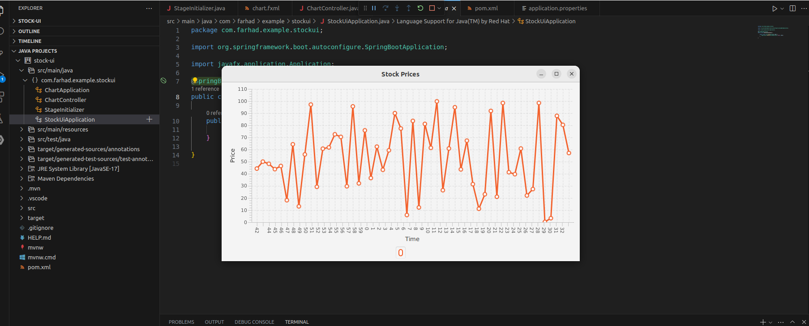
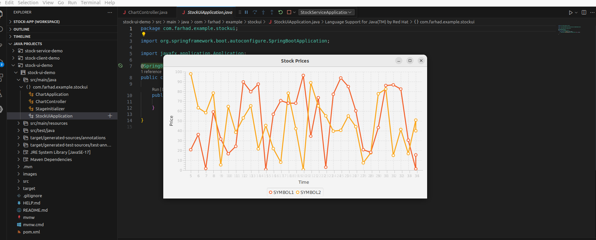
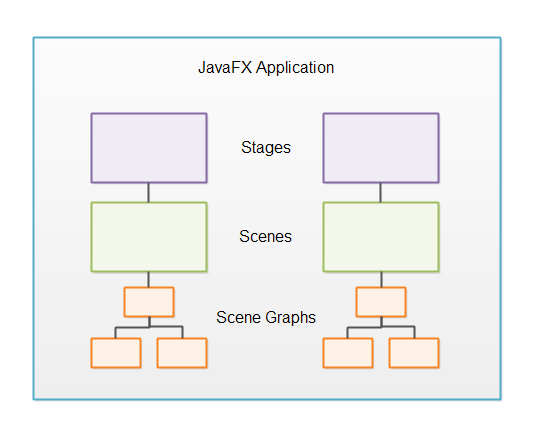

## Stock UI (javaFX)

 
 

### JavaFX Recap

In general, a ***JavaFX*** application contains one or more `stages` which corresponds ***to windows***. Each stage has a `scene` attached to it. Each `scene` can have an object graph of controls, layouts etc. attached to it, called the `scene graph`. 

***Stage***

***Scene***

***Scene Graph***

***Nodes***

All components attached to the scene graph are called nodes. All nodes are subclasses of a JavaFX class called javafx.scene.Node .

There are two types of nodes: Branch nodes and leaf nodes. A branch node is a node that can contain other nodes (child nodes). Branch nodes are also referred to as parent nodes because they can contain child nodes. A leaf node is a node which cannot contain other nodes.

***Controls***

JavaFX controls are JavaFX components which provide some kind of control functionality inside a JavaFX application. For instance, a button, radio button, table, tree etc.

> For a control to be visible it must be attached to the scene graph of some Scene object.  

> Example Controls: ***Accordion/Button/CheckBox/ChoiceBox/ColorPicker/ComboBox/DatePicker/Label/ListView/Menu/MenuBar*** ....

***Layouts***

JavaFX layouts are components which contains other components inside them. 
 
> A layout component must be attached to the scene graph of some Scene object to be visible.  

>Example Layouts: ***Group/Region/Pane/HBox/VBox/FlowPane***.....

***Nested Layouts***

***Charts***

JavaFX comes with a set of built-in ready-to-use chart components.

> Example Charts: ***AreaChart/BarChart/BubbleChart/LineChart/PieChart***....

***2D Graphics***

***3D Graphics***

***Audio***

***Video***

***WebView***

